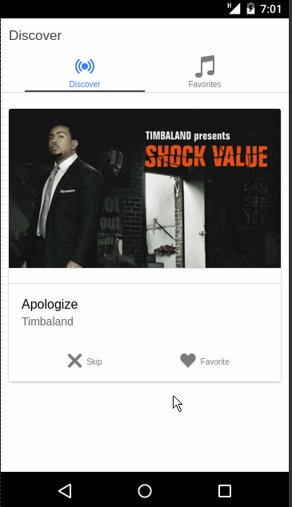

# 🔥 🎵 Minder
> Tinder for music using spotify API

  

---

### NOTE ✋ ⚠️  This uses `Ionic v1`, use it for reference purpose, upgrading to `Ionic v3` is planned for future
---

## 🔧 Prerequisites

* [node](https://nodejs.org/en/)

* [Ionic cli](https://ionicframework.com/docs/cli/)

## 🚀 Getting Started
* ` yarn global add ionic cordova`

* ` git clone https://github.com/ragmha/minder.git`

* ` yarn`

* ` ionic serve[options]`

## License
[MIT](./license) © [Raghib Hasan](http://raghibm.com/)
